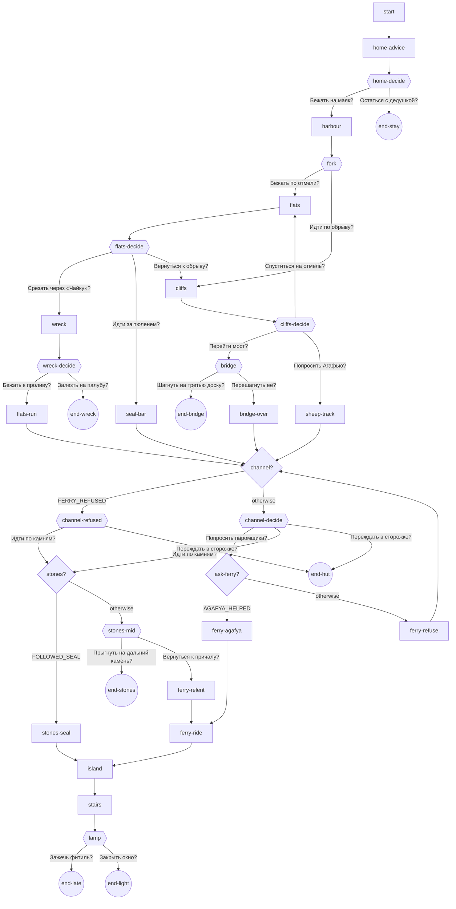

# Story map — Огонь на маяке

Page IDs are the `.id` values in [books/lighthouse.c](../../lighthouse.c).

## Route and locations

| # | Location | Role | Anchor the reader names | Act | Branches | Pages |
|---|---|---|---|---|---|---|
| 1 | Cottage (`cottage`) | start | grandfather's iron bed; the dark lighthouse in the window | 1 | all | 4 |
| 2 | Harbour and fork (`harbour`) | crossing | the pier with Timka; the old signpost | 1 | all | 2 |
| 3a | Tidal flats (`flats`) | danger | the wreck of the «Чайка»; the seal's rock | 2 | flats | 7 |
| 3b | Cliffs (`cliffs`) | danger | Agafya's hut; the rope bridge over the gully | 2 | cliffs | 6 |
| 4 | Channel landing (`channel`) | bottleneck, danger | Savely's hut and boat; the stepping stones | 2 | all | 9 |
| 5 | Island (`island`) | arrival | the lighthouse door | 3 | all | 1 |
| 6 | Tower (`tower`) | goal | the spiral stair; the great lamp | 3 | all | 4 |

The route runs 70 m north from the village to the island (see
`rooms/layout.jpg`). Only the flats and cliffs link sideways, by the path up the
cliff face; every other move is forward.

## Travel

| From → to | How |
|---|---|
| cottage → harbour | Varya runs down the village street (story page) |
| fork → flats | the sand path down from the spit |
| fork → cliffs | the rocky path up the plateau's south face |
| flats ↔ cliffs | the path zig-zagging up the cliff face above the flats |
| flats → channel | wading north through the rising water, or along the dry sandbar |
| cliffs → channel | over the rope bridge, or round the gully by the sheep track, then down the north slope |
| channel → island | Savely's boat, or the six stepping stones |
| island → lamp room | the door, then a hundred spiral steps |

## Dangers and challenges

| Danger | Decision | Warning or clue before it | Sensible choice | Wrong choice leads to |
|---|---|---|---|---|
| Staying safe at home | risk or safety | the boats are out; only the lamp can guide them | go | `end-stay` |
| The tide on the flats | which way | Timka: fast but the water comes; the seal: whoever hurries through the «Чайка» stays on it | follow the seal, or go back to the cliffs | through the wreck: a second chance, then `end-wreck` if she climbs the deck |
| The rope bridge | risk | Agafya: don't touch the third plank; the picture shows it dark and green | step over it | `end-bridge` |
| The ferryman | whom to trust | Agafya: tell Savely I sent you | ask after walking with Agafya | he refuses; ask no more |
| The stepping stones | risk | the seal promised to help on the stones; the water rises | cross after following the seal; otherwise turn back | the far jump: `end-stones` |
| The storm at the landing | risk or safety | the lighthouse is still dark | go on | `end-hut` |
| The lamp | remembering | grandfather: close the window first, then light the wick | close the window | `end-late` |

## Characters

| Character | Where | States | Reacts to |
|---|---|---|---|
| Grandfather Matvei | cottage | feverish in bed; gives the warning; holds Varya's hand | whether she goes |
| Timka | harbour pier | mending nets; gives advice; rows out to fetch her at dawn | the wreck ending |
| The seal | flats, channel | on its rock; speaks; swims the sandbar; surfaces by the stones | helps on the stones only if followed |
| Agafya | cliffs | herding goats; warns; leads the sheep track; pulls Varya off the bridge | vouches to Savely if she led |
| Savely | channel | smoking; refuses; obeys Agafya; relents to a soaked girl; rows; fishes her out | Agafya's word, the failed stones |

## Page graph

## Endings

| Ending | Kind | Caused by | Warned by | How far along | Retry |
|---|---|---|---|---|---|
| `end-stay` | failure (early, safe) | «Остаться с дедушкой?» | the boats are out | page 3 | `home-decide` |
| `end-wreck` | failure | «Залезть на палубу?» | the seal's warning | flats | `wreck-decide` |
| `end-bridge` | failure | «Шагнуть на третью доску?» | Agafya; the green plank | cliffs | `bridge` |
| `end-stones` | failure | «Прыгнуть на дальний камень?» | the water over the stones | channel | `stones-mid` |
| `end-hut` | failure | «Переждать в сторожке?» | the dark lighthouse | channel | the channel page |
| `end-late` | partial | «Зажечь фитиль?» | grandfather's warning | lamp room | `lamp` |
| `end-light` | success | «Закрыть окно?» | — | lamp room | start over |

Every failure retries from the reader's last decision (the engine default).

## Choices

Ten decision pages, 23 choices: 11 about the way (bridge, flats, cliffs, wreck,
seal, back to the cliffs, down to the flats, run to the channel, stones, back
to the landing, the far stone), 4 about trust (Agafya, the ferryman, the seal,
grandfather), 8 about risk or safety (go or stay, deck, rotten plank, hut, wick
or window…). No page offers two choices with the same outcome.

## Facts

| Fact | Set by | Checked by | Effect |
|---|---|---|---|
| `FOLLOWED_SEAL` | `seal-bar` | `stones` | the seal leads Varya over the stones (`stones-seal`) instead of the dangerous `stones-mid` |
| `AGAFYA_HELPED` | `sheep-track` | `ask-ferry` | Savely rows her across (`ferry-agafya`) instead of refusing |
| `FERRY_REFUSED` | `ferry-refuse` | `channel` | the landing page drops «Попросить паромщика?» (`channel-refused`) |

Nothing is carried. Grandfather's warning is remembered by the reader, not by
a fact.

## Thresholds

- **Act 1 → 2:** the fork; from here each road is new country and the tide
  starts to rise (picture: the water climbs camera by camera).
- **Act 2 → 3:** the island; the storm arrives, the light is almost gone.

## Picture states

| Place | States |
|---|---|
| Flats | low water (`flats-show-wreck`), rising (`flats-climb-wreck`, `flats-show-tide`, `flats-run-stones`, `flats-follow-seal`), high (`flats-night-wreck`) |
| Bridge | whole (`cliffs-cross-bridge`), third plank broken (`cliffs-hang-bridge`) |
| Channel | stones showing (`channel-show-ferry`), awash (`channel-stones-mid`) |
| Lamp room | window open, lamp dark (`lamp-show-window`, `lamp-wind-out`); window shut, lamp lit (`lamp-light-shines`) |

## Failure and danger

Every failure is telegraphed and ends with Varya safe (rescued by Timka,
Agafya or Savely) and the lighthouse dark; the partial ending grounds a boat
but hurts nobody.

## Secrets and alternatives

- Secret: following the seal (dry sandbar, help on the stones).
- Alternatives: flats or cliffs; switch between them by the cliff-face path;
  ferry or stones; Agafya's word or Savely relenting.

## Golden path

`start` → `home-advice` → `home-decide` *Бежать на маяк?* → `harbour` →
`fork` *Идти по обрыву?* → `cliffs` → `cliffs-decide` *Попросить Агафью?* →
`sheep-track` → `channel-decide` *Попросить паромщика?* → `ferry-agafya` →
`ferry-ride` → `island` → `stairs` → `lamp` *Закрыть окно?* → `end-light`:
14 pages across all seven places.
