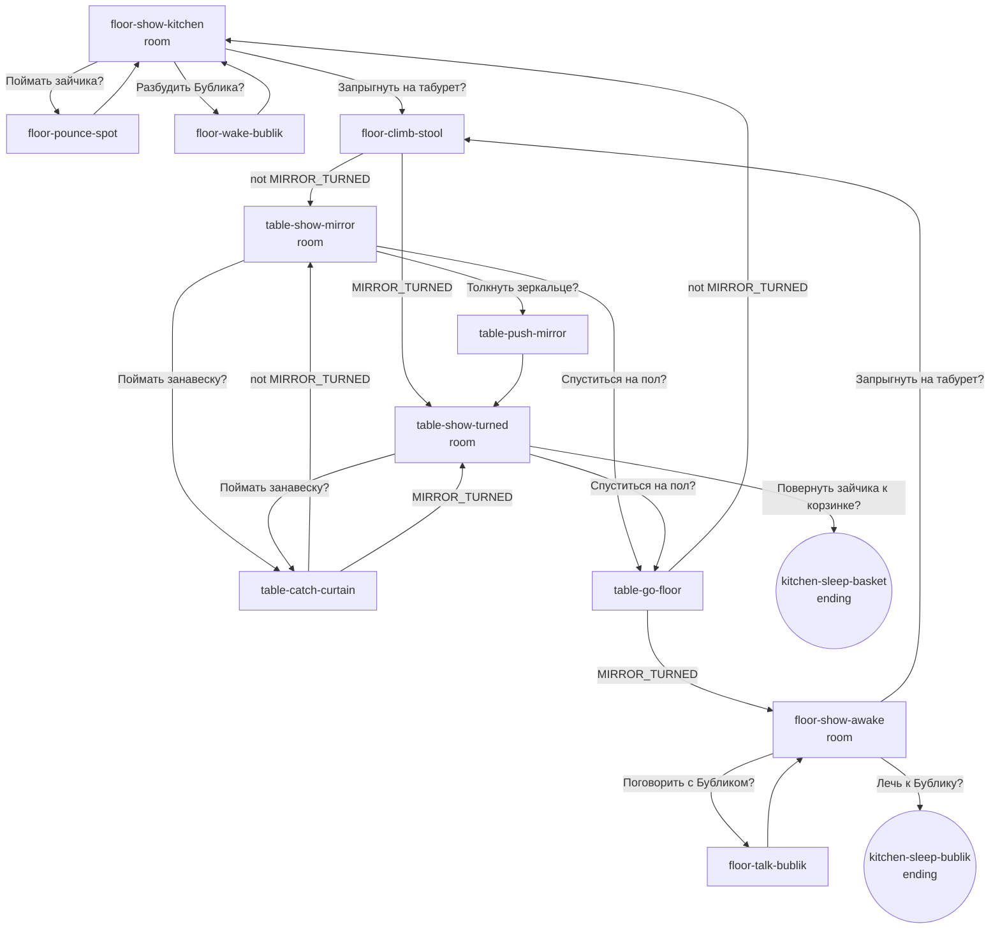

# Story map — Мира и лунный зайчик

## Locations

| Location | Role | Visual anchor | Acts |
|---|---|---|---|
| **Kitchen floor** (`kitchen-floor`) | start, rest, ending | the dresser with the moon-spot on its lower door; Бублик on his mat by the glowing stove | 1, 2, 3 |
| **Kitchen table** (`kitchen-table`) | reveal | grandmother's round mirror on its stand under the window | 1, 2 |

Both are views of one kitchen: from the table Mira sees the whole floor, and
from the floor the table and window are always in the background.

## Routes

| From → to | Physical move | Back |
|---|---|---|
| floor → table | jump onto the stool seat (45 cm), then front paws onto the table edge and a hop up (30 cm higher, 5 cm gap) | table → stool → floor, the same surfaces in reverse |

There is no other route. The window sill (95 cm) is above the table but no page
needs it.

## Challenges

### 1. The spot cannot be caught (understanding)

- **Blocks:** light has no body. Jumping at it only moves Mira's shadow.
- **Clue chain:**
  - `floor-show-kitchen` text: the spot trembles whenever the curtain moves
    (text and painted curtain).
  - `floor-pounce-spot` text and picture: the spot slides onto Mira's back
    instead of into her paws.
  - `floor-wake-bublik` dialogue: "it comes from the window".
  - `table-show-mirror` text and picture: a pale beam runs from the mirror on
    the table to the dresser.
- **Sensible choice:** climb to the table and push the mirror.
- **Tempting wrong choices:** pounce again (funny, same lesson); catch the
  curtain (funny; the spot goes out and comes back, proving it comes from the
  window).
- **Visible change when solved:** the spot jumps from the dresser to Бублик's
  nose, then lies on his mat; Бублик sits up.

### 2. Where should the spot sleep? (understanding a character)

- **Blocks:** nothing physical. The choice is whose bed the light warms.
- **Clue chain:** `floor-wake-bublik` or `floor-talk-bublik`: Бублик invites
  Mira to sleep by his warm side. `table-show-turned`: the rule "where the
  mirror turns, the spot goes" and the empty basket in the shadow.
- **Choices:** steer the spot to the basket (independence) or lie down with
  Бублик (friendship). Both are good endings.

## Characters

**Бублик**, old shaggy dog, always on his mat in front of the stove.

| State | Looks | Set by | Seen on |
|---|---|---|---|
| asleep | curled, chin on paws, snoring | start | `floor-show-kitchen`, `floor-pounce-spot`, `table-show-mirror` |
| one eye open | head lifted a little, one eye open, grumbling | waking him | `floor-wake-bublik` (then falls asleep again) |
| sitting, suspicious | sitting up, rubbing his nose, ears back | the spot lands on his nose | `table-push-mirror`, `floor-show-awake`, `table-show-turned` |
| friendly | sitting, head tilted, tail thumping | talking after the sneeze | `floor-talk-bublik` |
| asleep again | lying on his side | endings | `kitchen-sleep-basket` (background), `kitchen-sleep-bublik` (with Mira) |

He reacts to earlier choices: once invited, the awake floor page says so and
offers his ending; in the basket ending he mumbles his own clue back.

## Page graph

| Page | Kind | Exits |
|---|---|---|
| `floor-show-kitchen` | room | pounce, wake (until invited), stool |
| `floor-pounce-spot` | beat | floor |
| `floor-wake-bublik` | beat | floor |
| `floor-climb-stool` | beat | table (either state) |
| `table-show-mirror` | room | push, curtain, down |
| `table-push-mirror` | beat | turned table |
| `table-show-turned` | room | aim at basket, curtain, down |
| `table-catch-curtain` | beat | table (either state) |
| `table-go-floor` | beat | floor (either state) |
| `floor-show-awake` | room | talk (until invited) or lie down (once invited), stool |
| `floor-talk-bublik` | beat | awake floor |
| `kitchen-sleep-basket` | ending | — |
| `kitchen-sleep-bublik` | ending | — |

## Choices

| Page | Caption | Intention | Tests / expresses | Leads to |
|---|---|---|---|---|
| floor | Поймать зайчика? | pounce on the light | impulse; teaches that light slips away (playful, act 1) | `floor-pounce-spot` |
| floor | Разбудить Бублика? | ask the old dog | curiosity about a character; clue + invitation | `floor-wake-bublik` |
| floor | Запрыгнуть на табурет? | go up to the window | following the clue "from the window" | `floor-climb-stool` |
| table | Толкнуть зеркальце? | touch the thing the beam comes from | noticing the beam | `table-push-mirror` |
| table | Поймать занавеску? | chase the moving curtain | impulse again; proves the light comes through the window (playful, act 2) | `table-catch-curtain` |
| table | Спуститься на пол? | go back down | return to Бублик | `table-go-floor` |
| turned table | Повернуть зайчика к корзинке? | aim the spot at her bed | applying the rule; choosing her own place | ending 1 |
| awake floor | Поговорить с Бубликом? | make peace with the sneezing dog | kindness after a mishap | `floor-talk-bublik` |
| awake floor | Лечь к Бублику? | accept his invitation | friendship over having the spot to herself | ending 2 |
| awake floor | Запрыгнуть на табурет? | go back to the mirror | keep working on the spot | `floor-climb-stool` |

No two captions on one page share an outcome.

## Facts

| Fact | Set by | Checked by | Effect |
|---|---|---|---|
| `MIRROR_TURNED` | `table-push-mirror` | table and floor room pages, `floor-climb-stool`, `table-go-floor`, `table-catch-curtain` Continue | table shows `table-show-turned` and offers aiming; floor shows `floor-show-awake` with Бублик sitting and the spot on his mat |
| `BUBLIK_INVITED` | `floor-wake-bublik` or `floor-talk-bublik` | floor room pages, both endings | the floor stops offering "wake/talk" and, once the mirror has turned, offers "Лечь к Бублику?"; floor text recalls his words; the basket ending adds his sleepy "I told you" |

Two facts, both checked more than once. Nothing is carried.

## Thresholds

| Threshold | Locations that change |
|---|---|
| Act 1 → 2: the push | floor: Бублик sits up, the spot lies on his mat, the choices change; table: the spot is gone from the dresser, the text states the rule, aiming is offered |
| Act 2 → 3: the decision | the chosen bed fills with moonlight; the mirror points at it in the ending picture |

## Picture states

| Location | States (each its own camera) |
|---|---|
| Kitchen floor | Бублик asleep, spot on dresser (`floor-show-kitchen`); Бублик sitting, spot on his mat (`floor-show-awake`); spot in the basket (`kitchen-sleep-basket`); spot on the mat with Mira and Бублик asleep (`kitchen-sleep-bublik`) |
| Kitchen table | mirror facing the dresser (`table-show-mirror`); mirror turned toward the stove (`table-show-turned`) |

Beat pages that appear in both states (`floor-climb-stool`, `table-go-floor`,
`table-catch-curtain`) are framed so neither the dresser door nor the mat is in
shot; they need no second painting.

## Failure and danger

None. Every impulsive choice (pounce, curtain) is a short joke that returns
Mira to the same page with one more clue. Waking the dog earns a grumble and
help, never a threat.

## Secrets and alternatives

- **Secret:** the photograph of puppy Бублик chasing a sun-spot, painted by the
  window from the first page and named only in Бублик's ending.
- **Alternatives:** wake Бублик before climbing, or only talk to him after the
  sneeze; skip every joke; end in the basket or at Бублик's side.

## Golden path

`floor-show-kitchen` → *Запрыгнуть на табурет?* → `floor-climb-stool` →
`table-show-mirror` → *Толкнуть зеркальце?* → `table-push-mirror` →
`table-show-turned` → *Повернуть зайчика к корзинке?* → `kitchen-sleep-basket`.
